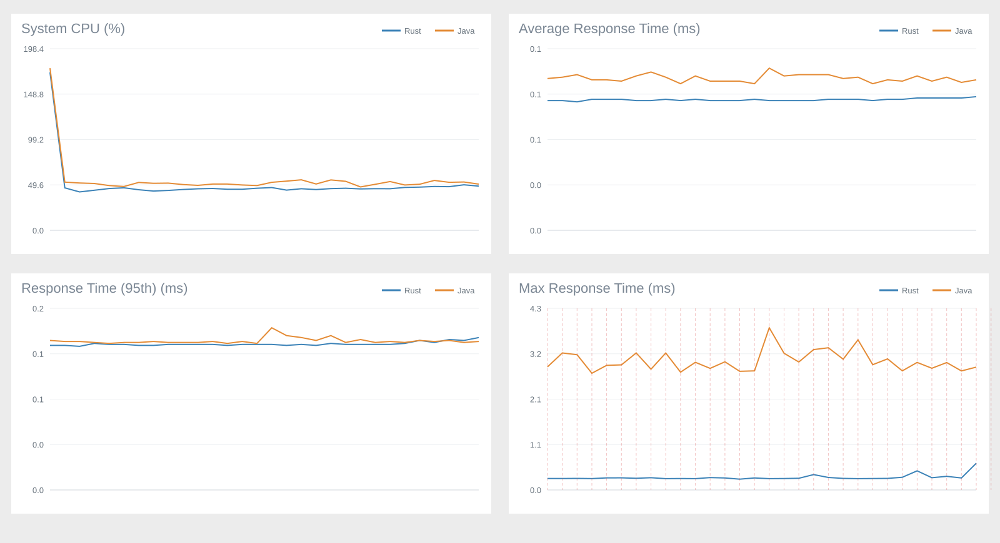

# Rust 键值存储（kv-storage-rust）

一个用 Rust 实现的、带持久化能力的键值存储，主要用于课程教学与演示。项目
采用清晰的分层架构，同时提供本地命令行和多客户端 TCP 服务器两种使用方式。

## 功能特性

- **领域层独立**：`domain` 只包含业务规则，不依赖文件或网络，便于单独测试。
- **先写日志再改内存**：修改命令按「校验 → 同步写 WAL → 修改内存」顺序执行，
  崩溃后可通过 WAL 恢复。
- **快照 + WAL 双重持久化**：JSON 快照缩短恢复时间，`SAVE` 或达到阈值时自动
  生成快照并压缩 WAL。
- **损坏检测**：快照和 WAL 都带校验和；数据文件损坏时程序拒绝启动，不会
  静默创建空数据库。
- **多客户端并发**：TCP 服务器为每个连接创建独立线程，通过 `Arc<Mutex<Engine>>`
  串行化共享状态，避免并发写坏数据文件。
- **运行指标**：活跃连接、累计连接、命令统计、收发字节、快照次数、运行时长。

## 架构分层

```text
domain       纯业务规则：命令、响应、错误和内存 Store
persistence  JSON 快照、WAL、校验和与损坏检测
engine       协调业务操作与持久化顺序
protocol     TCP 逐行文本协议（分帧、解析、格式化）
server       多客户端并发服务器
client       TCP 客户端与交互界面
metrics      线程安全的服务器运行指标
```

## 目录结构

```text
src/
├── domain/          # 纯业务规则：命令、响应、错误和内存 Store
├── persistence/     # JSON 快照、WAL、校验与损坏检测
├── engine.rs        # 协调业务操作和持久化顺序
├── protocol.rs      # TCP 逐行文本协议
├── server.rs        # 多客户端并发服务器
├── client.rs        # TCP 客户端与交互界面
├── metrics.rs       # 服务器运行指标
├── bin/
│   ├── kv-server.rs # 服务器程序入口
│   └── kv-client.rs # 客户端程序入口
├── main.rs          # 不需要网络的本地单机版入口
└── lib.rs           # 公共模块入口
```

`data/` 和 `server-data/` 是运行时数据目录，保存真实快照和 WAL；`target/`
是 Cargo 自动生成的编译目录，可以随时删除并重新构建。这些目录都不会提交到 Git。

## 快速开始

环境要求：Rust stable 工具链。运行 `rust_exp` 对照实验时还需要 JDK 17、
Python 3.10，以及 Maven 或 `javac`。

### 本地单机版

```bash
cargo run
```

默认数据保存在：

```text
data/
├── snapshot.json
├── snapshot.bak
└── wal.log
```

也可以指定独立数据目录：

```bash
cargo run -- --data-dir ./my-data
```

修改命令会先追加并同步 WAL，再修改内存。执行 `SAVE` 或正常退出时生成
`snapshot.json` 并压缩 WAL；重新启动时先加载快照，再重放快照之后的 WAL。

### TCP 服务器和客户端

先在第一个终端启动服务器：

```bash
cargo run --bin kv-server -- --addr 127.0.0.1:7878 --data-dir ./server-data --checkpoint-after 1000
```

再在第二个终端启动客户端：

```bash
cargo run --bin kv-client -- --addr 127.0.0.1:7878
```

请求和响应都使用以换行符分隔的简单文本协议，单条消息最大 64 KiB。客户端发送
`EXIT` 或 `QUIT` 后只断开当前连接，服务器会继续等待下一个客户端。不同客户端的
网络收发可以并行；内存修改、WAL 写入和快照操作按单条命令串行，避免并发写入
破坏数据文件。

服务器默认每累计 1000 次成功修改自动生成 JSON 快照，并在快照安全落盘后压缩
WAL。可以使用 `--checkpoint-after N` 修改阈值，设置为 0 时关闭自动快照。自动
快照失败不会撤销已经写入 WAL 的命令：客户端会收到维护警告，完整 WAL 继续保留，
服务器会在后续命令达到条件时重试。

## 命令参考

| 命令 | 说明 |
| --- | --- |
| `SET key value` | 写入新键，或覆盖已有键 |
| `UPDATE key value` | 修改已有键（键不存在时报错） |
| `GET key` | 查询指定键 |
| `DELETE key` | 删除指定键 |
| `KEYS` | 按排序顺序列出全部键 |
| `STATUS` | 查看键数量与服务器运行指标 |
| `SAVE` | 生成 JSON 快照并压缩 WAL |
| `CLEAR` | 请求清空全部数据（需二次确认） |
| `HELP` | 显示帮助（客户端本地命令） |
| `EXIT` / `QUIT` | 断开连接并退出 |

## Rust 与 Java 对比实验

项目在 `rust_exp/` 中提供了一套独立的 Rust 与 Java G1 纯内存 KV 对比实验，
用于观察两种内存管理方式在持续对象替换压力下的延迟、CPU、常驻内存和 Java GC
行为。实验不会读取或修改正式 KV 项目的数据，也关闭 WAL、快照和逐条操作日志，
避免磁盘 I/O 掩盖内存管理差异。

### 实验设计

- Rust 与 Java 服务端使用相同的逐行 TCP 协议、每连接一线程模型、`HashMap` 和
  全局互斥锁。
- 统一使用 Rust 压测端，配置 32 个客户端、50000 个键和 1024 B value。
- 每轮预热 10 秒，以每秒 60000 次的计划速率运行 30 秒；两种实现交替执行 5 轮，
  最终取总体结果的中位数。
- Java 固定使用 256 MiB 堆和 G1 GC，并同步采集 GC 暂停日志；两端均采集 CPU
  和 RSS 数据。

### 正式实验结果

| 指标 | Rust | Java G1 | Java / Rust |
| --- | ---: | ---: | ---: |
| 平均延迟 | 101 μs | 124 μs | 1.23× |
| P95 | 149 μs | 155 μs | 1.04× |
| P99 | 174 μs | 824 μs | 4.74× |
| P99.9 | 249 μs | 2744 μs | 11.02× |
| 最大延迟 | 3948 μs | 15301 μs | 3.88× |

测量窗口内共记录到 836 次 Java GC 暂停，累计约 1418.262 ms，最大单次暂停约
70.377 ms。五轮中位数表明两者 P95 接近，但 Java G1 在 P99、P99.9 和最大延迟
上波动更明显；这支持“在当前覆盖写入负载与运行配置下，Rust 的尾延迟更可预测”
这一有限结论。图中的吞吐负载是压测端的计划速率，不代表系统的最大吞吐能力；
逐秒结果与 GC 暂停也只能说明时间相关性，不能把每个延迟峰值都直接归因于 GC。



完整实验说明、复现步骤、原始 CSV、GC 日志和资源采样数据见
[`rust_exp/README.md`](rust_exp/README.md) 与
[`formal-summary.md`](rust_exp/results/formal-20260903-123413/formal-summary.md)。

## 检查

```bash
cargo test
cargo fmt --check
cargo clippy --all-targets -- -D warnings
```

## 演示

分窗口手动演示请参考 [DEMO_GUIDE.md](DEMO_GUIDE.md)。
